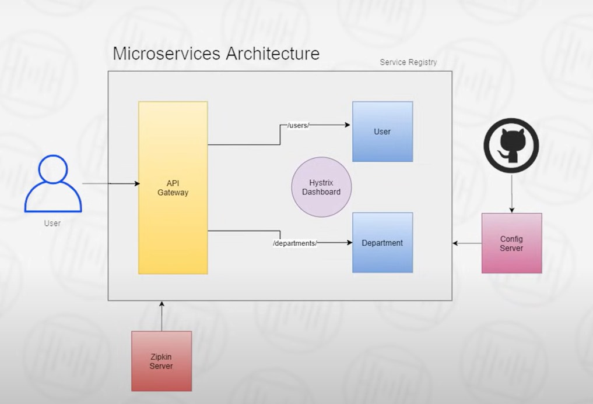

# Employee Management Microservice🌱

#### Welcome to the Employee Management Microservice, a robust solution designed to streamline your organization's employee management processes. Leveraging cutting-edge technologies and a microservice architecture, this project empowers businesses to efficiently manage their workforce, optimize operations, and enhance productivity.

---

## Key features
### Service Registry
The Service Registry component, built using Eureka, provides a centralized platform for service discovery and registration. This enables seamless communication and coordination between microservices, facilitating scalability and fault tolerance.

### Hystrix Dashboard
Employing Hystrix Dashboard, our microservice integrates circuit breaker patterns, ensuring resilience in the face of network failures and latency issues. By monitoring and controlling the flow of traffic between services, Hystrix Dashboard enhances system stability and prevents cascading failures.

### Config Server
The Config Server module enables dynamic configuration management across all microservices. By externalizing configuration details and supporting version control, Config Server enhances flexibility, promotes consistency, and simplifies the deployment process.

### API Gateway
Our microservice incorporates an API Gateway to manage incoming requests and route them to the appropriate microservices. This centralized entry point enhances security, facilitates load balancing.

### Zepkin Server
Utilizing Zipkin Server, our microservice offers distributed tracing capabilities, enabling real-time monitoring and analysis of transaction flows across interconnected services. By visualizing performance bottlenecks and identifying latency issues, Zipkin Server empowers organizations to optimize resource allocation and enhance system efficiency.

